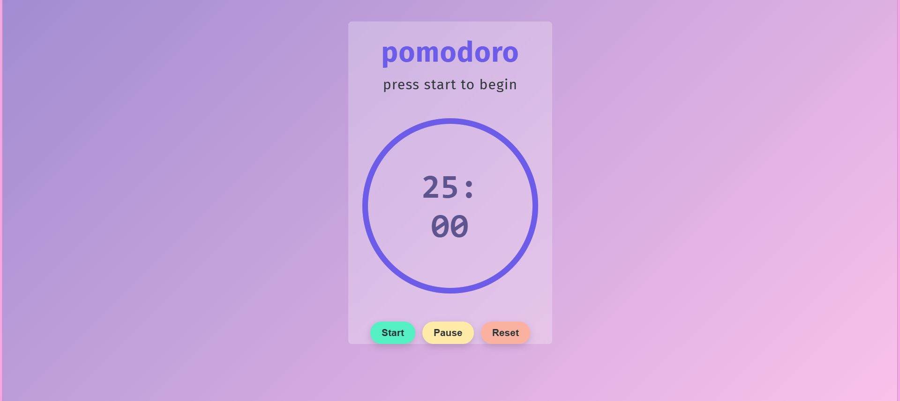

# 🎯 FocusFlow – Pomodoro Timer

FocusFlow is a minimalist and aesthetic Pomodoro Timer web application designed to help users improve focus, manage time efficiently, and boost productivity.

Built using HTML, CSS, and JavaScript, the application combines functionality with a clean pastel-themed user interface.

---

## 🚀 Features

- ⏱ Start, Pause, and Reset functionality
- 🎨 Soft pastel-themed responsive UI
- 🔵 Circular progress indicator
- 🧠 Structured Pomodoro time management technique
- 💻 Built with pure HTML, CSS, and Vanilla JavaScript

---

## 🛠 Technologies Used

- HTML5
- CSS3
- JavaScript (Vanilla JS)
----------------------------

 FocusFlow-Pomodoro-Timer/
│
├── index.html
├── style.css
├── app.js
└── README.md

----------------------------

---

## 💡 How It Works

The Pomodoro Technique is a productivity method where you:
1. Work for a fixed time (typically 25 minutes)
2. Take a short break
3. Repeat the cycle

FocusFlow implements this logic with interactive controls and dynamic UI updates using JavaScript.

---

## 📸 Preview

---

## 🔮 Future Improvements

- Add session customization (25/50 min options)
- Add sound notification
- Add dark mode toggle
- Store session history using localStorage

---

## 👩‍💻 Author

Developed by Kavyashree V

---
